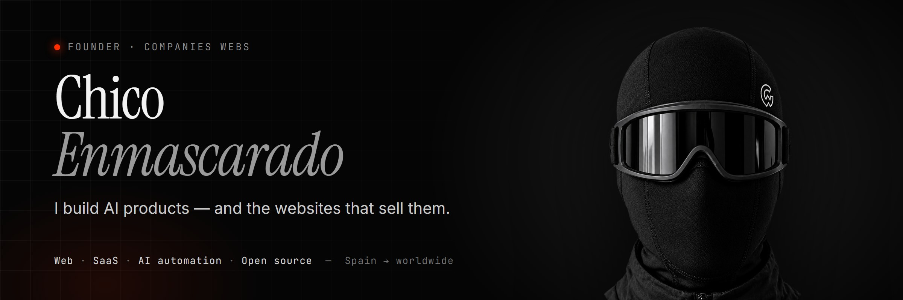

  
  
  
  

### The face is hidden. The work isn't.

I run **[Companies Webs](https://www.companieswebs.com)**, a studio in Spain that ships websites, SaaS and AI automation for real businesses. I stay anonymous on purpose: you should judge me by what ships, not by a headshot.

What I care about: products that people actually use, interfaces that feel expensive, and AI that does the boring work instead of the demo.

---

### 🔨 Building now

**🌎 [Omi](https://github.com/BasedHardware/omi) for the Spanish-speaking world** &nbsp;·&nbsp; *open source*
Omi's desktop apps only spoke English. I'm localizing it end to end for ~500M Spanish speakers: [9 pull requests](https://github.com/chicoenmascarado/omi/pulls) covering a Spanish string table for the macOS app, a translated Windows UI (Spanish + Brazilian Portuguese), Latin-American Spanish transcription, custom transcription vocabulary, and backend notifications and AI advice generated in the user's language.
`Swift` `TypeScript` `Python`

**🖥️ [Kairos](https://github.com/chicoenmascarado/kairos)** &nbsp;·&nbsp; *open source, pre-alpha*
The best of macOS, Linux and Windows, rebuilt on top of Windows: native, AI-assisted, free. &nbsp;[Website →](https://kairoswebsite.vercel.app)
`C#` `PowerShell`

**📰 Titulares IA** &nbsp;·&nbsp; *private*
An automated newsroom that turns AI news into Spanish short-form video: `ingest → AI judge → script → voice → render`, end to end.
`TypeScript` `Remotion` `Gemini` `Playwright`

---

### 🧩 Selected work

| | What it is | Built with |
|---|---|---|
| **[Companies Webs](https://www.companieswebs.com)** | The studio's site: 3 languages, GSAP motion, a blog that writes a post every day | Next.js 16 · Tailwind · GSAP |
| **Heidi Method** | AI speaking coach for English learners, with real-time voice conversation | Gemini Live · ElevenLabs · Stripe |
| **Gesti** | Dealership management software, built from scratch: inventory, sales pipeline, follow-ups | JavaScript · SaaS |
| **[El Distrito](https://www.eldistrito.pro)** | Site for a music collective, with a playable "career mode" game in the browser | TypeScript · Supabase |

Most client work lives in private repos. Happy to walk you through any of it.

---

### ⚙️ Stack

  

---

### 🤝 Let's talk

- **Companies & founders** — need someone who can ship product *and* take it to market in Spanish? → [info@companieswebs.com](mailto:info@companieswebs.com)
- **🇪🇸 ¿Tienes un negocio?** Webs, software a medida y automatizaciones con IA. → [companieswebs.com](https://www.companieswebs.com)

Faceless by choice. Measured by what ships.

